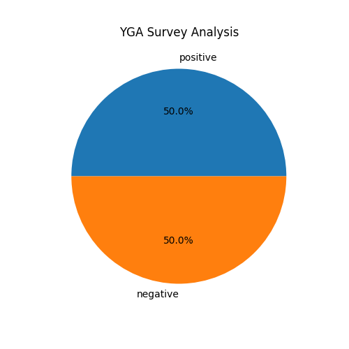
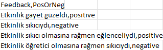

📜 **SURVEY CLASSIFIER** \
\
&emsp; This app is a Dockerized Deep Learning application that classifies survey feedbacks as positive or negative. The app takes in a CSV file containing survey feedbacks and outputs a new CSV file with an additional column indicating whether each feedback is positive or negative. (Feedbacks should be row by row in input csv file)

🚀 **ATTENTION!** The model did not being uploaded due to the size. You should download as .pkl file and put the path `app/model/<model_name>.pkl`. Do not forget to change model name in model.py file also.
Model link -> **https://huggingface.co/savasy/bert-base-turkish-sentiment-cased**.
You need to create .pkl file yourself using steps in the link and `pickle` library
\
\
You can download the docker app using the command `docker pull omerkaanvural/yga-survey-analysis:yga-survey-analysis-app`
\
After you download the app you can modify this command by your machine and run 
\
**`docker run -v $(pwd)/Desktop/anket.csv:/app/data/anket.csv -v $(pwd)/Desktop:/app/data/ omerkaanvural/yga-survey-analysis:yga-survey-analysis-app --input /app/data/anket.csv --output /app/data/predictions.csv --graph /app/data/dist.png`**
\
\
🍰 Also a pie chart created indicating p/n ratio by --graph command
\
\
**Here is the sample 👇**
\

\

